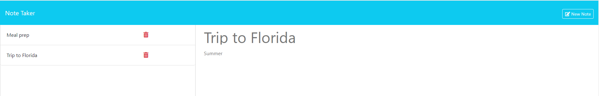

# Note Taker
    

    
## Table of Contents
    
[Description](#description)
    
[Usage](#usage)
    
[License](#license)
    
[Questions](#questions)
    
## Description
    
 Note Taker allows you to manage your notes. Notes can be saved for later viewing or deleted.

 

 A link to the website can be found here.
       
## Usage
    
 To use, click the start button to navigate to the notes page. From there you can input a new note title as well as text and save it. You can click on any saved note title to view the text associated with it. In addition, clicking the read trash can will delete a saved note.
    
## License
    
[MIT](https://opensource.org/licenses/MIT)
    
## Questions
    
GitHub: [AnthonyRqqq](https://github.com/AnthonyRqqq)
    
Email: anthony_rosati@yahoo.com
    